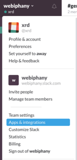
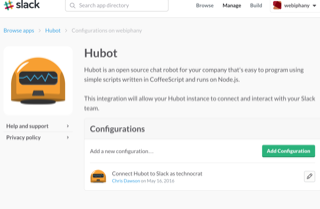
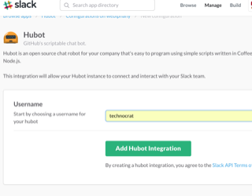

# Technocrat Signal

## Build a Technocrat Signal

Developer in distress? Put out the technocrat signal and get immediate help from a superhero!


## Components

* a Hubot with Slack adapter (in coffeescript) that listens for developers in distress!
* a classifier (in Ruby) that uses machine learning to understand which superhero to call!
* an Android app that displays the technocrat signal to the right superhero!

These components teach you about the most important parts of hubot:
the Hubot API, the Hubot brain, the HTTP client, and the HTTP server.

## Installation

To use, install the [Docker Toolbox](https://www.docker.com/products/docker-toolbox) and [VirtualBox](https://www.virtualbox.org/wiki/Downloads).

Make sure you are using at least these versions:

```
$  docker-compose --version
docker-compose version 1.7.0, build 0d7bf73
$ docker-machine --version
docker-machine version 0.7.0, build a650a40
$ docker --version
Docker version 1.11.1, build 5604cbe
```

Then, run this command to build the playground (in a machine called "technocrat").

```
$ docker-machine create --driver virtualbox technocrat
$ docker-machine start technocrat
$ git clone https://github.com/xrd/technocrat-signal.git
$ cd technocrat-signal
$ eval $(docker-machine env technocrat)
$ docker-compose build  # go get a coffee
```

## Create a hubot

First, you need to create a hubot integration inside your slack site.

* Click on the tick under your username inside the Slack browser client (you need to be an admin of the site)
* Search for hubot and choose it when it comes up.
* Create a new configuration
* Add relevant information, like the slackbot username
* Once your bot is up, you need to invite her/him to the channels you want them to participate in.








Then, use the API key below when running these steps.

```
$ docker-compose run hubot create-hubot myfirsthubot
$ echo 'myfirsthubot' >> hubot/hubots/current-hubot.txt # Tell "docker-compose up" to use this hubot
$ echo 'HUBOT_SLACK_TOKEN=xx-12345' >> hubot/hubots/myfirsthubot/hubot-credentials.txt # establish credentials
$ docker-compose run hubot run-hubot myfirsthubot # start it up without redis backed brain
$ docker-compose run hubot enable-brain myfirsthubot # add [ "hubot-redis-brain" ] to external-scripts.json
$ docker-compose up # start it all with redis turned on and the hubot connected
```

Jasmine (test runner is bundled) and can be used to run tests for your hubot.
To run tests, create a spec directory and put tests in there. Then, run this command
(using the example `withtests` application).

```
$ docker-compose run -w /home/hubot/hubots/withtests hubot jasmine-node --coffee spec/
.

Finished in 0.008 seconds
1 test, 1 assertion, 0 failures, 0 skipped


```

Or, from inside a one-off container if you want.
```
$ docker-compose run hubot bash
hubot@6eb956781ea:~# cd hubots/withtests
hubot@6eb956781ea:~# jasmine-node --coffee spec
hhhhhhubot@ff42a4ed1740:~/hubots/withtests$ jasmine-node --coffee spec
.

Finished in 0.008 seconds
1 test, 1 assertion, 0 failures, 0 skipped

```


See an example of tests in this spec file [slack-utils.spec.coffee](/hubot/hubots/withtests/spec/slack-utils.spec.coffee)
and the [slack-utils.coffee library](/hubot/hubots/withtests/lib/slack-utils.coffee) it tests.

## Start the Docker Appliance

```
$ docker-machine up
```

This starts the classifier, and the "current" hubot backed by a redis for persisting the brain.

Now, use the [Android app](https://github.com/xrd/technocrat-android/) to skip Slack completely.

### Enabling Docker for Android on a Real Device

By default your docker machine will not be accessible to the outside world. You can port forward the Hubot status 
using a bridged adapter.

Follow these [instructions](https://github.com/docker/machine/issues/1491#issuecomment-172325129) to setup a bridged adapter.

Then, run this command

```
$ VBoxManage controlvm technocrat natpf1 "hubot,tcp,,8080,,8080"
```
